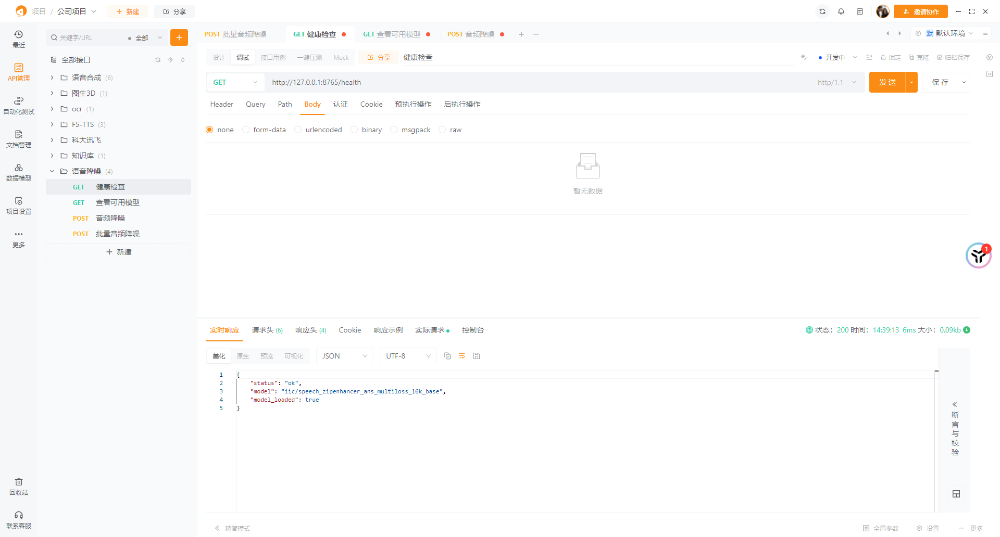
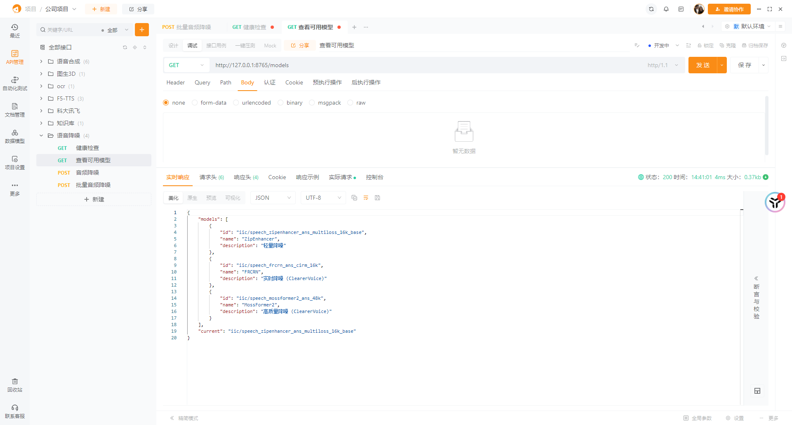
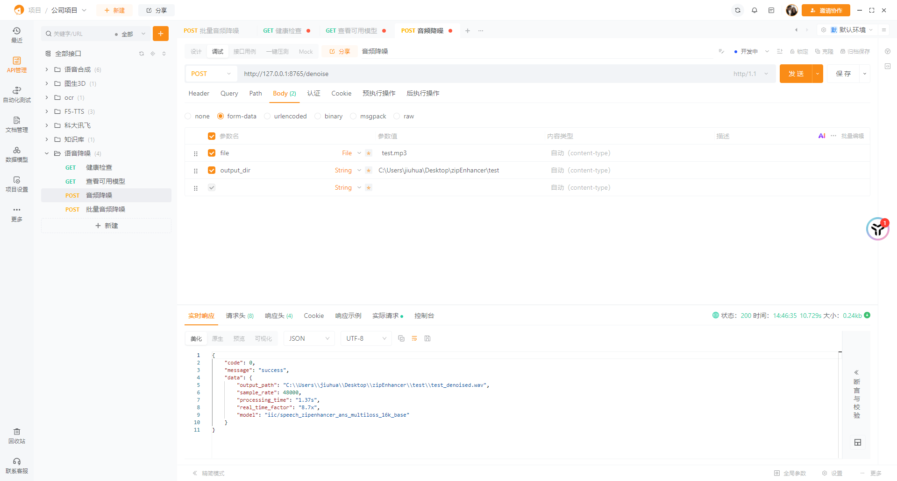

<div align="center">

<pre>
 ______       _____       _                               
|__  (_)_ __ | ____|_ __ | |__   __ _ _ __   ___ ___ _ __ 
  / /| | '_ \|  _| | '_ \| '_ \ / _` | '_ \ / __/ _ \ '__|
 / /_| | |_) | |___| | | | | | | (_| | | | | (_|  __/ |   
/____|_| .__/|_____|_| |_|_| |_|\__,_|_| |_|\___\___|_|   
       |_|                                                
</pre>

</div>

<p align="center">
  <a href="https://www.python.org/"></a>
  <a href="https://fastapi.tiangolo.com/"></a>
  <a href="https://pytorch.org/"></a>
  <a href="https://github.com/gyj1201/zipEnhancer/blob/master/LICENSE"></a>
  <a href="https://www.docker.com/"></a>
  <a href="https://modelscope.cn/models/iic/speech_zipenhancer_ans_multiloss_16k_base"></a>
</p>


### 做了什么

- **模型剥离** — 从 ModelScope 黑盒 pipeline 中提取出 ZipEnhancer，用原生 PyTorch 加载权重推理，不再依赖 pipeline 封装
- **FP16 半精度推理** — 仅模型计算部分使用 FP16，STFT/iSTFT 保持 FP32 避免 cuFFT 精度问题，显存占用降低 ~40%
- **长音频分段** — 4s 滑动窗口 + 75% 重叠的 overlap-add 策略，支持任意时长音频，彻底解决 CUDA OOM
- **多模型切换** — 同时支持 ZipEnhancer（轻量）、FRCRN（实时）、MossFormer2（高质）三种模型
- **声道/位深保持** — 立体声输入 → 立体声输出，32-bit float / 16-bit PCM 自动适配

### 它能做什么？

- 清除录音中的**环境噪声**（空调声、风扇声、键盘声、街道噪音等）
- 支持**单文件**和**批量处理**两种模式
- 多种降噪模型**一键切换**
- GPU 加速，实时率可达 **20x 以上**（RTX 4090）

无需 ModelScope pipeline 黑盒，一行命令启动服务，适合集成到语音处理流程、会议录音后处理、音频预处理管道等场景。

## 效果演示

两个测试样本的降噪前后对比（默认模型，全力降噪）：

| 样本 | 原始带噪 | 降噪后 |
|------|---------|--------|
| 样本 1 | [▶ 播放](https://raw.githubusercontent.com/gyj1201/zipEnhancer/master/demo/mp3_audio/speech_with_noise.mp4) | [▶ 播放](https://raw.githubusercontent.com/gyj1201/zipEnhancer/master/demo/mp3_audio/speech_with_noise_denoised.mp4) |
| 样本 2 | [▶ 播放](https://raw.githubusercontent.com/gyj1201/zipEnhancer/master/demo/mp3_audio/speech_with_noise1.mp4) | [▶ 播放](https://raw.githubusercontent.com/gyj1201/zipEnhancer/master/demo/mp3_audio/speech_with_noise1_denoised.mp4) |

> 测试音频来自 [ModelScope 官方 demo](https://www.modelscope.cn/models/iic/speech_zipenhancer_ans_multiloss_16k_base/summary)。

## 快速开始

### 方式一：手动部署

**1. 创建虚拟环境**

```bash
conda create -n zipenhancer python=3.10 -y
conda activate zipenhancer
```

**2. 安装依赖**

```bash
pip install -r requirements.txt
```

GPU 加速（NVIDIA 显卡，**先于上一步**安装 CUDA 版 PyTorch）：

```bash
pip install torch torchaudio --index-url https://download.pytorch.org/whl/cu124
pip install -r requirements.txt
```

**3. 配置**

复制 `.env.example` 为 `.env`，按需求修改：

```bash
cp .env.example .env
```

**4. 启动**

```bash
uvicorn app:app --host 0.0.0.0 --port 8765
```

### 方式二：Docker 部署

**1. 前置条件**

安装 [Docker](https://docs.docker.com/engine/install/) 和 [NVIDIA Container Toolkit](https://docs.nvidia.com/datacenter/cloud-native/container-toolkit/install-guide.html)。

**2. 构建并启动**

```bash
# 从 docker/ 目录启动
cd docker
docker compose up -d

# 或从项目根目录直接运行
docker run --gpus all -p 8765:8765 zipenhancer:latest
```

所有依赖和模型已在构建时下载，启动即用，无需额外等待。

## API 接口

### 健康检查

```bash
curl http://127.0.0.1:8765/health
```



### 查看可用模型

```bash
curl http://127.0.0.1:8765/models
```



### 语音降噪（单个文件）

上传音频文件，指定输出文件夹，降噪后的文件自动保存到该目录。

```bash
curl -X POST http://127.0.0.1:8765/denoise ^
  -F "file=@input.wav" ^
  -F "output_dir=./output" ^
  -F "output_format=mp3" ^
  -F "bitrate=192k" ^
  -F "strength=0.7"
```

**参数说明：**

| 参数 | 必填 | 说明 |
|------|------|------|
| `file` | 是 | 音频文件（wav/mp3/m4a/flac/ogg） |
| `output_dir` | 是 | 输出文件夹路径 |
| `model` | 否 | 模型名称（默认 .env 中配置） |
| `normalize` | 否 | 是否自动音量归一化（默认 true） |
| `target_sr` | 否 | 输出采样率，0=保持原始采样率（默认 0） |
| `output_format` | 否 | 输出格式: wav / flac / mp3 / ogg（默认 wav） |
| `bitrate` | 否 | 比特率，仅 mp3/ogg，如 "192k" |
| `compression_level` | 否 | 压缩级别，仅 flac (0-8) |
| `strength` | 否 | 降噪强度 0.0~1.0（默认 1.0=全力降噪） |

**返回结果：**

```json
{
  "code": 0,
  "message": "success",
  "data": {
    "output_path": "./output/input_denoised.mp3",
    "sample_rate": 48000,
    "output_format": "mp3",
    "output_subtype": "mp3_mf",
    "bitrate": "192k",
    "compression": null,
    "processing_time": "0.62s",
    "real_time_factor": "22.0x",
    "model": "iic/speech_zipenhancer_ans_multiloss_16k_base",
    "strength": 1.0
  }
}
```



### 语音降噪（批量处理）

扫描输入文件夹中的所有音频文件，逐个降噪并保存到输出文件夹。

```bash
curl -X POST http://127.0.0.1:8765/denoise/batch ^
  -F "input_dir=./input_folder" ^
  -F "output_dir=./output_folder"
```

**参数说明：**

| 参数 | 必填 | 说明 |
|------|------|------|
| `input_dir` | 是 | 输入文件夹路径 |
| `output_dir` | 是 | 输出文件夹路径 |
| `model` | 否 | 模型名称（默认 .env 中配置） |
| `normalize` | 否 | 是否自动音量归一化（默认 true） |
| `target_sr` | 否 | 输出采样率，0=保持原始采样率（默认 0） |
| `output_format` | 否 | 输出格式: wav / flac / mp3 / ogg（默认 wav） |
| `bitrate` | 否 | 比特率，仅 mp3/ogg，如 "192k" |
| `compression_level` | 否 | 压缩级别，仅 flac (0-8) |
| `strength` | 否 | 降噪强度 0.0~1.0（默认 1.0=全力降噪） |

**返回结果：**

```json
{
  "code": 0,
  "message": "success",
  "data": {
    "input_dir": "./input_folder",
    "output_dir": "./output_folder",
    "total": 10,
    "success": 10,
    "failed": 0,
    "total_time": "5.23s",
    "model": "iic/speech_zipenhancer_ans_multiloss_16k_base",
    "strength": 1.0,
    "output_format": "flac",
    "results": [
      {
        "filename": "audio1.wav",
        "output_path": "./output_folder/audio1_denoised.flac",
        "sample_rate": 48000,
        "output_format": "flac",
        "output_subtype": "PCM_16",
        "compression": 5,
        "processing_time": "0.52s",
        "real_time_factor": "28.0x",
        "status": "success"
      }
    ]
  }
}
```

### 输出格式说明

输出文件会尽可能保留原始音频的参数：
- **采样率**：默认与原始文件一致（传 `target_sr` 可覆盖）
- **声道数**：立体声输入 → 立体声输出，单声道输入 → 单声道输出
- **位深**：32-bit float 输入 → 32-bit float 输出，16-bit → 16-bit
- **输出格式**：可通过 `output_format` 参数选择

#### 格式支持矩阵

| 格式 | 编码选项 | 压缩率参考 | 依赖 |
|------|---------|-----------|------|
| WAV | PCM_16 / PCM_24 / PCM_32 / FLOAT | 无损（基准） | soundfile |
| FLAC | PCM_16 / PCM_24，compression 0-8 | ~40-60% | soundfile |
| MP3 | 32-320 kbps | ~15-25% | ffmpeg |
| OGG Opus | 6-510 kbps | ~15-25% | ffmpeg |

> 压缩率参考基于 48kHz 16-bit 单声道音频，实际因内容而异。
> MP3/OGG 依赖 ffmpeg，系统未安装时将返回错误。
> FLAC 输出时不支持的编码（FLOAT/DOUBLE/PCM_32）自动降级为 PCM_16。

### 切换模型

```bash
curl -X POST http://127.0.0.1:8765/denoise ^
  -F "file=@input.wav" ^
  -F "output_dir=./output" ^
  -F "model=iic/speech_frcrn_ans_cirm_16k"
```

## 可用模型

| 模型 ID | 说明 |
|---------|------|
| `iic/speech_zipenhancer_ans_multiloss_16k_base` | ZipEnhancer（轻量） |
| `iic/speech_frcrn_ans_cirm_16k` | FRCRN（实时降噪） |
| `iic/speech_mossformer2_ans_48k` | MossFormer2（高质量） |

## Roadmap

### 已完成
- [x] 单文件语音降噪
- [x] 批量文件语音降噪
- [x] 多模型切换（ZipEnhancer / FRCRN / MossFormer2）
- [x] 音量归一化
- [x] 自定义输出采样率
- [x] 声道/位深保持
- [x] FP16 半精度推理

### 计划中

#### P0 — 短期（5-8 周）
- [x] Docker 一键部署（多阶段构建、GPU 直通、健康检查、优雅关闭）
- [x] 输出格式选择（WAV / MP3 / FLAC / OGG，编码参数可配）
- [ ] 输入音频信息预览（波形峰值、LUFS 响度、削波检测、完整性校验）
- [x] 降噪强度控制（频域掩码指数，0~100% 可调）  论文参考：DeepFilterNet

### P1 — 中期（4-6 个月）
- [ ] Noise Gate（Attack / Release / Hold / Hysteresis / Look-ahead）
- [ ] 残差监听（延迟对齐 + 位深统一，输出原始与降噪的差值信号）
- [ ] 频段选择降噪（Linkwitz-Riley 分频，各频段独立降噪强度）
- [ ] VAD 自动静音切除（Silero VAD + 状态机 + 自适应阈值 + Cross-fade 拼接）

### P2 — 中后期（5-7 个月）
- [ ] CLI 命令行工具（多命令、管道、进度条、配置文件）
- [ ] 噪声轮廓学习（基于 VAD 的自适应谱减法后处理、音乐噪声抑制）
- [ ] 质量评估指标（PESQ / STOI / Si-SNR / DNSMOS，离线评测管线）
- [ ] 音频格式转换（ffmpeg 封装，格式兼容矩阵，元数据透传）

### P3 — 长期
- [ ] 异步任务 + 进度查询（2-3 个月，任务持久化、队列调度、Worker 池、Webhook）
- [ ] Web UI 界面（3-4 个月，拖拽上传 + 波形/频谱可视化 + 在线试听 + Before/After 对比）
- [ ] 去混响（4-8 个月，WPE + DNN，场景分类 + 参数矩阵）
- [ ] 实时流式降噪（4-8 个月，WebSocket + 因果模型 + Jitter Buffer + AEC）

### 已评估放弃
- ~~超分（低采样率 → 高采样率）~~ — 研究级难题，和降噪正交
- ~~模型量化 int8~~ — 模型架构（自定义算子）不支持
- ~~语音识别（ASR）~~ — 另一个产品领域
- ~~说话人分离~~ — 重叠说话人问题当前无工业级开源方案


## 项目结构

```
├── app.py                 # FastAPI 服务主程序
├── log.py                 # 日志管理模块
├── API.md                 # API 接口文档（含 curl 测试示例）
├── zipenhancer/           # 降噪核心包
│   ├── __init__.py
│   ├── codec.py           # 音频编码模块（WAV/FLAC/MP3/OGG）
│   ├── denoise.py         # 降噪核心函数
│   ├── standalone.py      # 剥离版推理（纯 PyTorch）
│   ├── models/            # 模型架构
│   │   ├── zipenhancer.py
│   │   └── layers/
│   │       ├── generator.py
│   │       ├── scaling.py
│   │       ├── zipenhancer_layer.py
│   │       └── zipformer.py
│   └── configs/
│       └── configuration.json
├── demo/
│   ├── audio/             # 演示音频（原始 WAV）
│   └── mp3_audio/         # 演示音频（GitHub 播放用 MP4）
├── tests/                 # 测试
│   ├── conftest.py
│   ├── test_codec.py
│   ├── test_denoise.py
│   ├── generate_test_data.py
│   └── audio/             # 测试音频文件
├── images/                # README 截图
├── requirements.txt       # 依赖列表
├── LICENSE                # MIT 开源许可证
├── .env                   # 环境配置（不上传）
├── .env.example           # 环境配置模板
├── .gitignore             # Git 忽略规则
├── README.md              # 使用文档
└── logs/                  # 日志输出目录
    ├── app/               # 全部日志
    └── error/             # 错误日志
```

## Credits

- 降噪模型：[阿里达摩院 ZipEnhancer](https://modelscope.cn/models/iic/speech_zipenhancer_ans_multiloss_16k_base)（Apache 2.0）
- 模型提取参考：[boreas-l/zipEnhancer](https://github.com/boreas-l/zipEnhancer)

## License

[MIT](LICENSE) © 2024 gao yi jun
